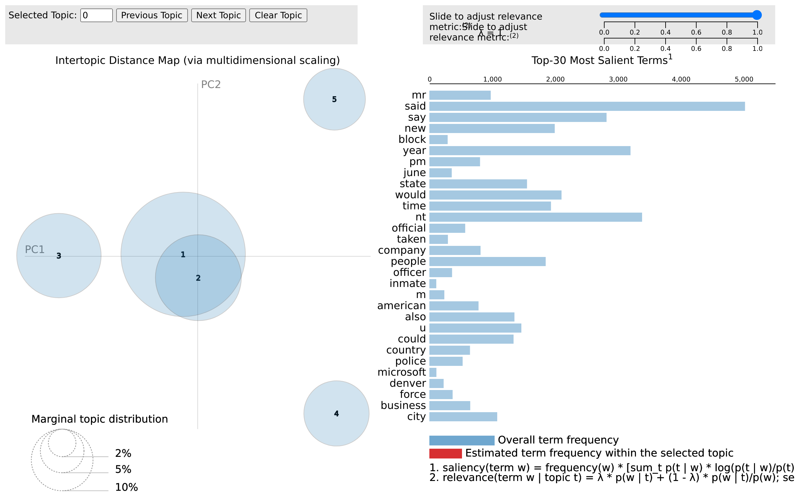
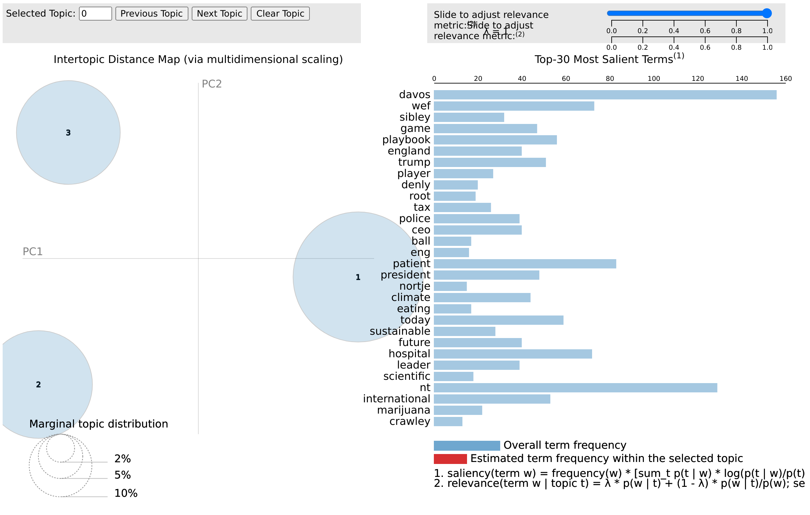
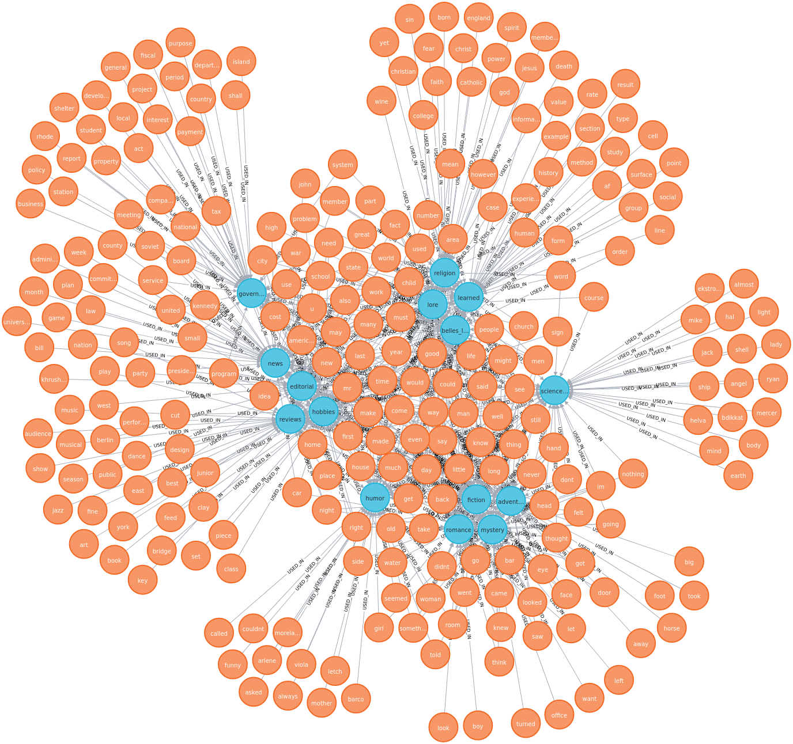
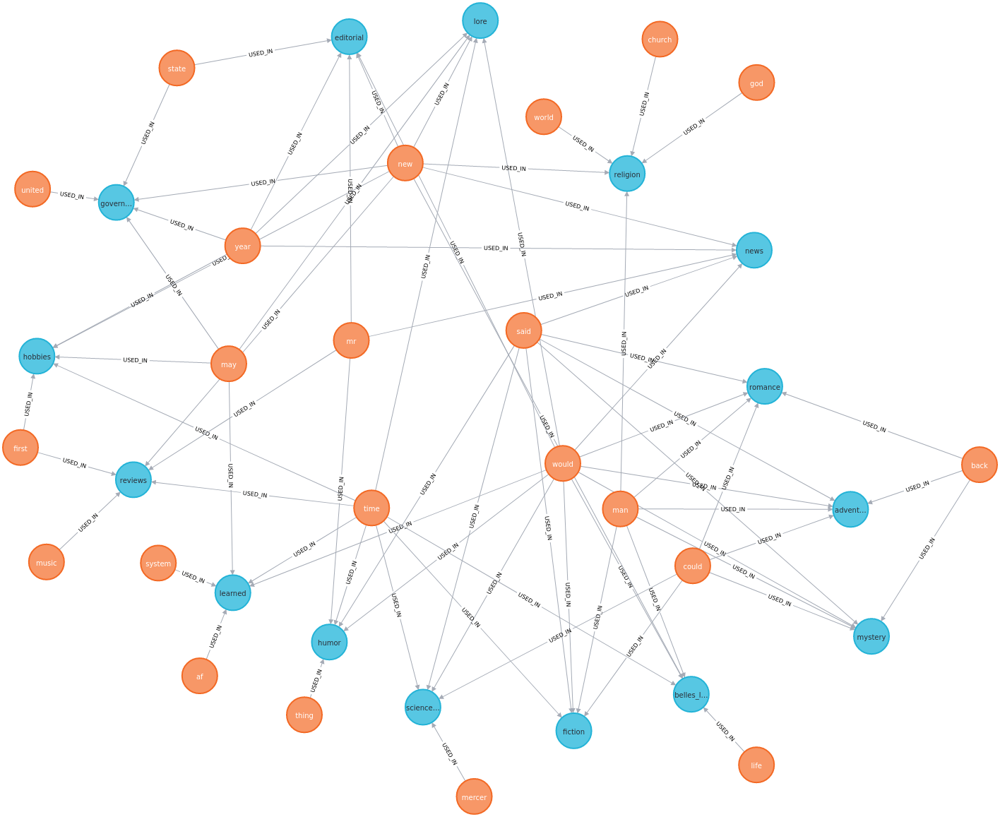

# Report esercitazioni

## 1.1 e 1.2
In questo esercizio ho provato due calcoli di similarità differenti.
Il primo metodo consiste nel misurare la similarità come rapporto tra 
la cardinalità dell'intersezione tra tutte le definizioni e la lunghezza media delle definizioni.

é stato impossibile applicare questo metodo in quanto l'intersezione tra le definizioni è vuota.
Nel secondo metodo ho calcolato la  frequenza di  ogni parola utilizzata nelle definizioni
e ho calcolato la similarità com rapporto tra la somma delle frequenze associate ad ogni parola,
diviso la lunghezza della definizione.

In questo modo ho regolarizzato i punteggi, pesando la somma delle frequenze in base al numero di parole utilizzate.

I risultati osservati sono stati:

|Concept|Similarity|
|  ---  |  ---  |
|courage|0.49|
|paper|0.48|
|apprehension|0.40|
|sharpener|0.59|

|Aggregation|Similarity|
|  ---  |  ---  |
|abstract|0.45|
|concrete|0.53|
|generic|0.48|
|specific|0.50|

Definire un concetto astratto o generico è meno vincolante rispetto a definire un concetto concreto o specifico.
Le definizioni dei concetti atratti e generici sono caratterizzate da una variabilità più alta di termini,
di conseguenza le frequenze associate ai termini sono più basse.

Al contrario, le definizioni dei concetti concreti e specifici sono caratterizzate da una variabilità più bassa
di termini, di conseguenza le frequenze associate ai termini sono più alte.

Per la misura di similarità che ho scelto quindi i punteggi dei concetti atratti e generici sono più bassi 
rispetto ai concetti concreti e specifici.

\pagebreak

|Concept| Most frequent words|
|  ---  |  ---  |
|courage| ['ability', 'fear', 'face', 'situation', 'something', 'allows', 'strength', 'u']|
|paper| ['material', 'wood', 'tree', 'product', 'write', 'cellulose']|
|apprehension| ['something', 'anxiety', 'state', 'feeling', 'feel', 'fear', 'bad', 'mental']|
|sharpener| ['pencil', 'tool', 'sharpen', 'make', 'something', 'blade', 'object', 'sharp']|

\pagebreak

## 1.3
In questa esercitazione ho collegato due risorse, wordnet e property norms.
Dal file delle property norms sono state estratte due colonne, "concept" e "feature", le informazioni sono state 
organizzate secondo un dizionario contenente il concetto come chiave e una lista di feature come valore.

Le feature di wordnet sono state estratte andando a prendere aggettivi e nomi dalla descrizione del synset 
ricavato  attraverso l'algoritmo di Lesk.

Il programma mostra quindi il concetto estratto dalle property norms, associato alle feature trovate in wordnet e a 3 
possibili nuove feature prese dalle property norms.
Le feature da aggiungere sono state scelte prendendo le 3 feature più frequenti non presenti in wordnet.

|   |   |
| --- | --- |
|CONCEPT|cat|
|WORDNET FEATURES|['feline', 'thick', 'soft', 'domestic', 'mammal', 'fur', 'ability', 'cat', 'wildcat']|
|PROPERTY NORMS FEATURES|['ear', 'fish', 'pointy']|

|   |   |
| --- | --- |
|CONCEPT|raven|
|WORDNET FEATURES|['large', 'black', 'straight', 'bird', 'bill', 'tail']|
|PROPERTY NORMS FEATURES|['intelligent', 'sound', 'feather']|

|   |   |
| --- | --- |
|CONCEPT|seagull|
|WORDNET FEATURES|['white', 'aquatic', 'short', 'bird', 'leg']|
|PROPERTY NORMS FEATURES|['distinctive', 'yellow', 'sound']|

\pagebreak

## 1.4
In questa esercitazione ho scelto come verbo transitivo "bless".
Abbiamo deciso di costruire il corpus attraverso la piattaforma Sketch engine utilizzando come parole chiave
"bless", "theology" e "religion". 

Così facendo ho ottenuto  un corpus di circa trentamila frasi.
Abbiamo estratto dal corpus tutte le frasi  in cui appariva la parola "bless" e la sua forma passiva "blessed" ottenendo 
così più di mille istanze da esaminare.

L'estrazione del soggetto e del complemento oggeto della frase è stata effettuata attraverso due funzioni.
La funzione di estrazione dell'oggetto prende in input la frase  tokenizzata, 
l'iterazione inizia dal verbo e procede all'indietro  esaminando i termini uno ad uno. 

la funzione seleziona il primo termine che soddisfa la regola di estrazione, ovvero una parola che non sia 
nè un verbo nè un avverbio.

La funzione di estrazione del complemento oggetto funziona in maniera identica, l'unica  differenza è che l'iterazione 
parte dal verbo e procede in avanti nella frase.

| Subject       | Object              |
|---------------|    ---       |
| person        | person              |
| communication | cognition           |
| state         | communication       |
| act           | state               |
| group         | quantity            |
| feeling       | attribute           |
| attribute     | plant               |
| artifact      | group               |
| possession    | artifact            |
| cognition     | location            |
| phenomenon    | act                 |
| relation      | event               |
| quantity      | relation            |
| time          | Tops                |
| plant         | feeling             |
| location      | time                |
| motive        | substance           |
| event         | body                |
| object        | object              |
| body          | possession          |
| Tops          | animal              |
| substance     | shape               |

\pagebreak

## 1.5
In questo esercizio ho deciso di considerare i 3 termini più frequenti incontrati nelle definizioni come iperonimi 
del  concetto da ricercare.

Abbiamo visitato tutti gli iponimi di questi termini e ho calcolato uno score, sono stati trattenuti quindi
i 5 iponimi con lo score più alto.

Lo score equivale al numero  di termini in comune tra l'insieme delle definizioni e la gloss dell'iponimo in questione.
A questo punto, per ogni concetto ho ottenuto 3 insiemi di iponimi, con un apposita funzione ho scelto 
l'inisieme di iponimi la cui somma degli score è più alta.
    
|TARGET              | FORMS               |
| -----------------  | ---------------     |
|courage             | physical_ability.n.01, penetration.n.04, form.n.14, magical_ability.n.01, midas_touch.n.01|
|paper               | composite_material.n.01, paper.n.01, packing_material.n.01, aggregate.n.02, bimetal.n.01|
|apprehension        | apprehension.n.01, panic.n.01, creeps.n.02, intimidation.n.03, stage_fright.n.01|
|sharpener           | drill.n.01, jaws_of_life.n.01, plow.n.01, upset.n.04, abrader.n.01|

Come possiamo vedere, per "paper" e "apprehension" il task è riuscito, mentre per i concetti "courage" e "sharpener" no.
Abbiamo effettuato diverse prove variando  il numero di iperonimi.

Abbiamo notato che aumentando troppo quuesta quantità i risultati  peggiorano. 
Ciò è dovuto al fatto che la funzione considera termini meno frequenti e considera quindi iponimi più lontani
dai concetti target. 

Questi risultati ci mostrano come gli score degli iponimi legati alle parole
meno frequenti, non siano lontani dagli score degli iponimi legati a parole più frequenti.

\pagebreak

## 2.1

In questa esercitazione ho cercato di implementare una algoritmo di segmentazione simile a quello riportato 
nell'articolo di Marti A Hearst. 

La funzione ha 3 parametri,testo, numero di iterazioni e numero di breakpoints.
Nella prima iterazione i breakpoint vengono istanziati in maniera che siano quasi equidistanti tra di loro.

l'unità è la frase, quindi inizialmente avremo k segmenti con lo stesso numero di frasi per ognuno di loro.
le tokenizzazione in frasi è stata effettuata con le  funzioni  di libreria nltk. 

La funzione chiave è "find_breakpoints" che è quella che aggiorna i breakpoint esistenti.
la funzione prende in input il breakpoint odierno e a partire da quel punto effettua due ricerche, una in avanti e una 
all'indietro.

l'algoritmo verifica la sovrapposizione tra due frasi alla volta e appena trova  un punto con sovrapposizione zero 
restituisce il breakpoint. 

In questo modo abbiamo trovato un possibile punto in cui è avvenuto un possibile cambio di tema.
la funzione find breakpoint quindi troverà due brakpoint, uno risultate dalla ricerca in avanti e uno risultante dalla 
ricerca all'indietro. A questo punto verrà selezionato il breakpoint più vicino.
Se non vengono trovati punti con sovrapposizione zero, il breakpoint non viene aggiornato.

Una volta trovati i nuovi breakpoint si procede al calcolo della coesione intra-gruppo.
Per fare ciò ho creato dei vettori per ogni frase all'interno del segmento e il punteggio è stato ottenuto
attraverso il prodotto interno di quest'ultimi.
Il punteggio del singolo segmento equivale alla somma delle componenti del vettore ottenuto dal prodotto interno. 

Questo punteggio ci è servito a valutare la qualità della segmentazione.
L'algoritmo effettua n iterazioni e quindi n possinili  segmentazioni.
Ad ogni segmentazione è associato uno score che è la somma dei punteggi intra-gruppo.

A questo punto verrà selezionata la segmentazione con lo score maggiore.

L'algoritmo è stato testato ssu 5 articoli diversi, di seguito vediamo un possibile output:

\pagebreak

| Breakpoints | Segmentation score |
| --- | --- |
| 6, 11, 14, 24, 26, 30, 34, 36, 41, 45 | 3.37 |
| 7, 11, 15, 25, 27, 31, 34, 37, 41, 45 | 3.28 |
| 8, 9, 17, 26, 28, 32, 33, 40, 41, 45 | 3.31 |
| 8, 10, 11, 27, 30, 32, 34, 40, 41, 45 | 1.84 |
| 9, 10, 14, 28, 31, 33, 36, 40, 41, 45 | 2.92 |
| 9, 11, 15, 30, 32, 34, 37, 40, 41, 45 | 2.20 |
| 10, 14, 17, 31, 33, 36, 37, 40, 41, 45 | 2.73 |
| 11, 15, 24, 32, 34, 36, 37, 40, 41, 45 | 3.61 |
| 14, 17, 25, 33, 34, 36, 37, 40, 41, 45 | 2.00 |
| 15, 24, 26, 33, 34, 36, 37, 40, 41, 45 | 2.12 |

Best segments:  [11, 15, 24, 32, 34, 36, 37, 40, 41, 45], Score: 3.61

i numeri nella lista rappresentando l'indice della frase in cui si è posizionato il breakpoint.
Facendo dei test si può vedere come all'aumentare dei breakpoint il punteggio intra-gruppo aumenta. 

Ciò deriva dal fatto che il punteggio si basa sulla sovrapposizione tra termini all'interno del cluster. 
Avere più breakpoint singnifica avere cluster più piccoli e di conseguenza, sovrapposizione maggiore.

\pagebreak

## 2.2

In questa esercitazione ho utilizzato la libreria gensim per effettuare topic modeling. 
Il modello utilizzato è LDA, ed è stato applicato su due corpus diversi.

Il COCA (Corpus of Contemporary American English) è uno dei corpus più grandi di inglese americano esistenti
ed è diviso in 8 categorie. 

Al fine di non allungare troppo i tempi di esecuzione, è stata selezionata solo la categoria "newspaper".
Il corpus "coronavirus" è una raccolta di frasi riguardanti il covid dal 2020 in poi, estrapolate da giornali e 
magazine online.

I corpus sono stati divisi in 10 blocchi ed è stato effettuato un preprocessing. 
Dopo il preprocessing sono state trattenute le content word: nomi, verbi, avverbi e aggettivi.

Il modello è stato settato per estrapolare 5 topics dal corpus COCA e 3 topic dal corpus coronavirus.  
In seguto ho sfruttato le librerie di gensim per produrre un file html per la visualizzazione dei dati.

\pagebreak

Il file di visualizzazione è diviso in due sezioni interattive.
Nella sezione di sinistra possiamo vedere una rappresentazione spaziale dei topic estrapolati effettuata attraverso 
scaling multidimensionale.

La grandezza della circonferenza indica la distribuzione marginale dei termini all'interno del topic.
Nella sezione di destra troviamo un grafico a barre che ci mostra i 30 termini più frequenti 
e le rispettive frequenze.

\pagebreak

## 3.1 

In questa esercitazione ho implementato un grafo utilizzando neo4j. 
l'obiettivo è stato quello di costruire e visualizzare un grafo a partire dal brown corpus. 

Il brown corpus è suddiviso  in 15 categorie, per  ogni categoria ho selezionato le 50  parole più frequenti.
Le parole più frequenti sono diventate i nodi "word" del grafo, mentre le categorie i nodi "category".

A questo  punto ho creato la relazione USED_IN per collegare le parole alle categorie, la relazione inoltre contien 
la frequenza della parole  coinvolta nella relazione. 

Nel grafo possiamo vedere come una stessa parola possa essere collegata a più  categorie, il grafo risultante 
infatti è composto da 289 nodi e 750 relazioni.

